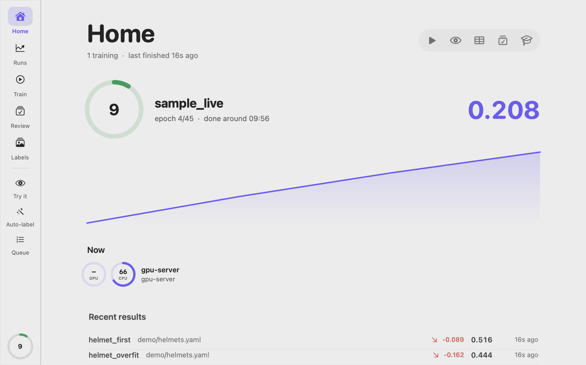
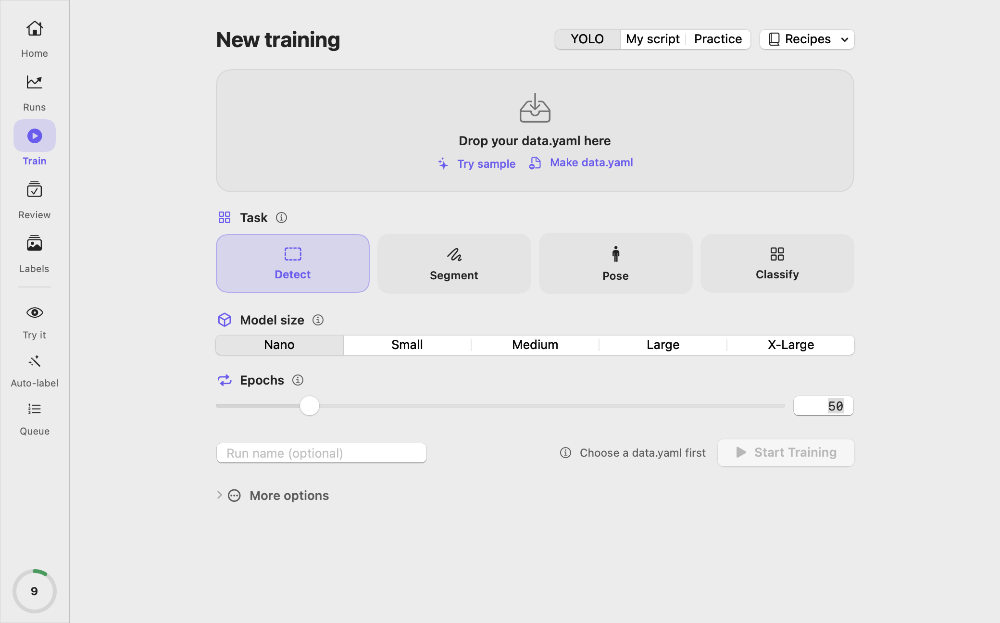
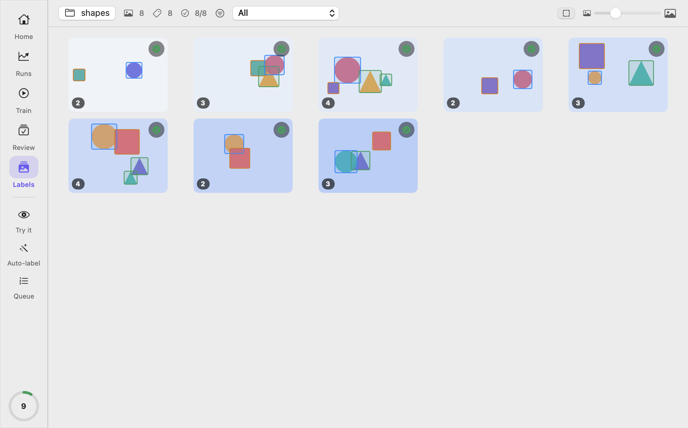

<p align="center">
  
</p>

<h1 align="center">Epokio</h1>

<p align="center">
  See your model training from the macOS menu bar, or from a web page on Windows, Linux and your phone.<br>
  Start runs, queue them, auto-label images, and read the results without opening a browser.
</p>

<p align="center">
  <a href="#install">Install</a> ·
  <a href="#what-it-does">What it does</a> ·
  <a href="#remote-gpu">Remote GPU</a> ·
  <a href="#on-windows-linux-or-your-phone">Windows / Linux</a> ·
  <a href="#한국어">한국어</a>
</p>

<p align="center">
  
</p>

---

## Why

I train YOLO models at work. Every run meant opening a terminal again and again to see whether it was
still alive, how many epochs were left, and whether the score was still going up. So the first thing
Epokio does is put that answer in the menu bar, where a glance is enough.

The second thing is the part I always did by hand afterwards: reading the curves and deciding what to
change next.

**1. See it without looking for it.** Progress, time left and best score live in the menu bar. A
character runs at the speed of your training and stops when the run stalls. Notifications when a run
finishes, fails with NaN loss, stalls, or stops early.

<p align="center">
  
  
</p>

**2. Read the result for you.** When a run ends, Epokio says in one paragraph why it scored what it
did and what to change next, from the numbers in your own files:

> Best mAP50-95 was 0.662 at epoch 7 of 40. Precision 0.86 is much higher than recall 0.73. It misses
> objects more often than it raises false alarms. Lower the confidence threshold or add examples of
> missed cases.

It reads the files your framework already writes (`results.csv`, `args.yaml`), so there is nothing to
add to your training code and nothing to sign up for.

Everything runs on your machines, and the macOS app follows dark mode, your accent color, Reduce Motion
and Increase Contrast.

## Problems it solves

* **"Is my training still running?"** See epoch, time left and best score in the macOS menu bar, without opening a terminal, TensorBoard or a browser tab.
* **"Tell me when YOLO training finishes."** A notification on your Mac, and a push to your phone (ntfy, Slack, Discord, Telegram), when a run finishes, fails, stalls or reaches a target score.
* **"Loss became NaN overnight."** Epokio flags diverged runs (NaN loss) and runs that stopped updating, so you do not find out in the morning.
* **"Which run was better?"** Compare Ultralytics, Hugging Face, PyTorch Lightning, Keras or TensorBoard-logged runs on one chart and in one table.
* **"Where does my model get it wrong?"** Rank validation images by score and review the worst ones, with labels and predictions drawn on top.
* **"I have to watch a GPU server over SSH."** Add the server in the Mac app with nothing installed on it, run `epokio watch` in the terminal, or open the web page from any laptop or phone.

## What it does

### Menu bar

* Progress, time left, and best score of every run, updated live
* GPU, CPU and memory, like Activity Monitor (Apple Silicon and NVIDIA)
* A notification when a run **finishes**, **fails** (loss became NaN), **stalls**, or **stops before its last epoch**
* A calm resting view when nothing is training
* **Just finished** card at the top: one click to the results
* **Characters that run at your training's speed**, like RunCat: a cat, a runner, a rocket, a neural net and six more. They stop when training stalls. Or upload your own GIF or frames. With nothing training, they can run with your CPU, GPU or AI tool use instead (Settings → Appearance)
* **⌥⌘E** opens the Studio window from any app, and **⌘K** jumps to anything in it. Almost every action has a keyboard shortcut

### Results

<p align="center">
  
</p>

Click any run to see what happened, in one place:

* **Scores** at the best epoch: precision, recall, F1, mAP50, mAP50-95, per head (box, pose, mask). Hover for what each one means.
* **Curves** for loss and scores, live while training runs
* **What stands out:** plain-language notes with a next step, such as *"Recall is much higher than precision. It finds most objects but raises many false alarms."*
* **Result images** your framework saved (curves, confusion matrix, predictions next to your labels), also from remote machines
* **How it was run:** for runs started from Epokio, the Python, PyTorch, Ultralytics and CUDA versions, the GPU, the git commit and the seed, so you can run it again the same way
* **Next steps:** try this model, review its mistakes, train again with the same settings, or resume a stopped run from `weights/last.pt`

**Compare** up to eight runs on one chart and in one table, with a list of only the settings that differed. **Sweeps** try several settings and rank them, with a parallel coordinates chart that shows which values led to the best score. **Notifications** stay in the bell at the top right, so a run that finished overnight is still there in the morning.

<p align="center">
  
</p>

### Studio window

<p align="center">
  
</p>

<p align="center">
  
</p>

**For beginners:** drop your `data.yaml` and Epokio checks it first: missing labels, classes with no examples, a validation set that is too small, very unbalanced classes. No dataset yet? Start with a tiny 8-image sample. Then pick a task (detect, segment, pose, classify), a model size and
the number of epochs, then press Start.

**For experts:** turn on *Show all settings* to get every training option of your installed Ultralytics
version, with its description. The list is generated from Ultralytics' own config file, so it stays
current when Ultralytics updates.

* **Try it:** drop an image and see what your model finds, with class names and confidence. Uses the CPU while a training run is using the GPU.
* **Datasets:** see your images with their YOLO boxes and pose keypoints drawn on top, and fix them: draw and move boxes, zoom and pan, pick classes from the keyboard (a searchable list when there are more than ten), and every change saves as you go. Boxes a model made are marked apart from the ones you checked. Filter by class, find images with no label, flip through with the arrow keys.
* **Review:** find your best and worst images. Labels are drawn in green, predictions in red, so you see at once what the model missed or invented. Mark each one as *model wrong*, *label wrong* or *not sure* with one key, and get a CSV for fixing labels or retraining.
* **Queue:** one job at a time on each GPU (a machine with several NVIDIA GPUs runs one per GPU; not yet tried on real multi-GPU hardware), survives restarts, reorder and cancel, live logs
* **Practice:** a pretend training run to learn the screens with no GPU and no data, and a short tour for your first real run. Neither starts real training by itself.
* **Auto-label:** pick a model and a folder of images. Labels are written to a separate `labels_auto/`
  folder, so your existing labels are never overwritten. You get a summary of what to review.
* **Reports:** a Markdown report with a leaderboard, precision, recall, F1 and mAP per head,
  the charts your framework produced, and plain-language notes such as
  *"Validation loss bottomed at epoch 32 and rose afterwards. The model may be overfitting."*

<p align="center">
  
</p>

## Install

> **On Windows or Linux?** Skip to [On Windows, Linux or your phone](#on-windows-linux-or-your-phone). This section is the Mac app.

1. Download `Epokio-x.y.z.dmg` from [Releases](https://github.com/8rulerstar/epokio/releases/latest) and drag Epokio to Applications.
2. Open it. That is all.

macOS 15 or later. The app carries its own helper (the *agent*) and its own small Python, so nothing
else is needed to watch runs. It then looks for training folders on its own, and opens the Studio
window so you can start even if the menu bar icon is hidden behind the notch. Starting a training uses
your own Python environment with Ultralytics and PyTorch in it; Epokio finds your environments
automatically.

A separate `pip install` is needed only on **other** machines that train, such as a Windows GPU PC
(see [Remote GPU](#remote-gpu)).

> **First launch:** the app is not notarized yet, so macOS blocks it the first time. Open it once, close
> the warning, then go to **System Settings → Privacy & Security**, scroll down and click **Open Anyway**
> next to Epokio. Right-click → Open no longer works on macOS 15 and later.
>
> **Icon missing from the menu bar?** On macOS 26 and later, allow Epokio in
> **System Settings → Menu Bar**.

### Build from source

```bash
git clone https://github.com/8rulerstar/epokio && cd epokio
python3 -m venv .venv && .venv/bin/pip install -e .
cd mac && ./build_app.sh --dmg        # build/Epokio.app and build/Epokio-x.y.z.dmg
```

Building needs Xcode 26 or later (the app uses the macOS 26 SDK); the built app runs on macOS 15 or later.
Training itself needs a Python environment with `ultralytics` and `torch`. Epokio finds your environments automatically.

## Built with Claude Code

I wrote this with Claude Code. The design, the decisions and what stays out are mine, and every number
in this README comes from a real run or a real test on my machine.

## Remote GPU

Train on a Windows or Linux machine, watch from your Mac.

```bash
# on the training machine
pip install epokio
epokio setup --lan --autostart
```

`epokio setup` finds your training folders, starts the helper without a console window, prints the
token to paste into the Mac app, and opens the page. `--lan` lets other machines on your network
reach it; `--autostart` brings the tray back when you log in. Run it again any time, it changes
nothing that is already right.

**Nothing to install on the server?** In the Mac app, open **Settings → Machines → Over SSH** and pick a host
from your `~/.ssh/config`. Epokio uses your SSH keys to copy the small log files (`results.csv` and similar)
every 15 seconds, never images or weights. The server only needs `python3`. This is view only: to start
training there, install the agent as above.

Without `--lan` the helper listens on this machine only, which is what you want if you just came
for the web page and the tray.

`--label lab-07` sets the name this machine shows as (handy when a class or a team watches many
machines; the default is the computer name). Over SSH, setup prints an `ssh -L` tunnel command
instead of opening a browser.

The helper answers when you reach it by IP address, `localhost`, or a name whose first part is this
machine's name (`pc`, `pc.lan`, `pc.tailXXXX.ts.net`; not `pc2.lan`). This blocks DNS-rebinding pages. For any other
name, set `EPOKIO_ALLOWED_HOSTS=trainer.example,other.name` on this machine, or send the token.

Install it wherever you like. The agent needs no third-party packages, so a small separate
virtual environment is the safe choice if you would rather not touch the Python your training uses.

* Watching on this machine needs no token: runs, scores, curves, notes and result images. Result
  images are served only from the folders the agent watches.
* An agent opened to the network (`--lan`) asks for the token to view as well, not only to start things.
* Give someone view-only access with a token of their own: `epokio agent --add-token alex --scope read`.
  It is shown once and stored hashed; `--list-tokens` and `--revoke-token alex` manage them. A read token
  can watch but cannot start or stop anything.
* **Everything else needs the token**, including requests that only look like reading: listing your
  Python environments, reading a training log, and checking a dataset folder all run a process or
  read outside the watched folders.
* Traffic is plain HTTP. Prefer an SSH tunnel (`ssh -L 8787:127.0.0.1:8787 gpu-pc`) or Tailscale over `--lan`, and keep it off shared or public networks.
* On a machine other people can log in to, turn on **Settings → General → Ask for the token even on this Mac** (or start the agent with `--require-token`). Otherwise anyone with an account there can read your runs over `127.0.0.1`.
* Korean and other non-ASCII file names are normalized between macOS (NFD) and Windows (NFC),
  so a path chosen on the Mac is found on the PC.

## On Windows, Linux or your phone

**You do not need a Mac.** Install on the machine that trains, run one command, and you have the
progress, scores, curves, result images, comparisons and phone alerts.

**Never used a terminal? On Windows:** download `Epokio.exe` from
[Releases](https://github.com/8rulerstar/epokio/releases/latest) and double-click it. It needs no Python to watch.
To train from the Train tab, install Python 3.10 or later first; the tab then sets up PyTorch and Ultralytics with one button. Windows SmartScreen may warn about an
unsigned app the first time: choose **More info → Run anyway**.

**With Python** (3.10 or later; from [python.org](https://www.python.org/downloads/), tick **Add python.exe to PATH**):

```bash
py -m pip install "epokio[tray]"
py -m epokio setup --autostart
```

(If typing `epokio` says "not recognized", use `py -m epokio` instead; it is the same command.)

**On a Linux server (Ubuntu 24.04, no desktop, over SSH):** system `pip` refuses to install
(PEP 668), so use a small virtual environment:

```bash
sudo apt install python3-venv
python3 -m venv ~/.epokio-venv
~/.epokio-venv/bin/pip install epokio            # no tray needed
~/.epokio-venv/bin/python -m epokio setup --root /data/runs --autostart
```

On a machine without a display, `--autostart` writes a systemd user service instead of a tray entry
and prints the two commands that turn it on. Setup does not open a browser there; it prints an
`ssh -L 8787:127.0.0.1:8787 <server>` command, and then `http://127.0.0.1:8787/` works on your own
computer. That tunnel is the safest way in. If you use `--lan` instead and ufw is on, allow your
network only: `sudo ufw allow from 192.168.0.0/16 to any port 8787 proto tcp`. Runs outside your home
folder (`/data`, `/mnt`, `/workspace`) are not found on their own, so pass `--root`. To log from your
own training code with `epokio.start`, install Epokio into the **training** environment too.

That finds your training folders, starts the helper with no console window, opens the page already
unlocked, and makes the tray come back when you log in. With `--lan`, Windows asks whether Python may
use the network: tick **Private networks** and click **Allow**, or your phone cannot connect. Turn that last part off again with
`epokio autostart --off`, or from the tray menu (*Start when I log in*). The entry is an ordinary
shortcut in your Startup folder, so you can also just delete it.

Review, auto-labelling and the label editor are in the Mac app only. Everything else here works
without one:

**Your own training loop.** Not using Ultralytics, Hugging Face, Lightning or Keras? Two lines make it show up like any other run:

```python
import epokio
with epokio.start("runs/detr-small", epochs=50, lr=1e-4, batch=16) as run:
    for epoch in range(1, 51):
        ...
        run.log(train_loss=tl, val_loss=vl, precision=p, recall=r, mAP50=m)   # tensors are fine
```

Logging never stops your training, even when the file is busy. In multi-GPU training only rank 0 writes. In a notebook, use the `with` block or call `run.finish()` after the loop, so the run shows as done; a run that ends with an error is never marked done.

**A web page.** On the training PC open `http://127.0.0.1:8787/` (setup opens it for you). From your phone or another computer, use the address setup printed (needs `--lan`). It works in any browser, to see runs, scores, curves, notes, result images, comparisons and notifications. No install, no account. The **Train** and **Queue** tabs start runs, reorder or remove what is waiting, show each job's log, and stop the one that is running after asking you. Pick what the model should learn and how big it is, and Train fills in the model; it checks the dataset before starting and stops you if it is broken. With no Python for training yet, one button sets one up (with CUDA PyTorch on a PC with an NVIDIA GPU). The queue shows the epoch, time left and finish time of the running job, and when a job fails it says why in plain words and what to change (GPU out of memory, Windows data loader workers, CPU-only PyTorch, wrong dataset paths and more). An Ultralytics run's page has **Train again with these settings**, and a stopped one that did not reach its last epoch also has **Resume**, which continues from `weights/last.pt` in the same folder with the Python that first ran it. On any run's page, **Main score** picks which logged value counts as the score, whether lower is better (loss, error rate), and a target that sends a phone alert when reached; the list, ranking and alerts follow it. **Compare** has a settings table for every run shown (only the settings that differ, next to each run's score, sortable by either, and included in the CSV), and for the runs you pick it shows only the settings that differ, warns when they used different data, filters by name or tag, and exports every run as a CSV. Under **Alerts** you can turn on phone alerts (ntfy, Slack, Discord or Telegram) without the Mac app. On the training PC they open unlocked when you start the page from the tray or setup. On another device they are locked until you paste the machine's token once (setup prints it with `--lan`, or run `py -m epokio agent --show-token`); the token stays in that browser. Train finds the Python environments on the machine (conda, python.org installs, project `.venv`s) and builds its settings from that environment's own Ultralytics.

**A terminal view.** On a server over SSH:

```bash
epokio watch                               # reads the agent on this machine, or the current folder
epokio watch --root runs/                  # no agent needed: read a folder directly
epokio watch --agent http://gpu-pc:8787    # watch another machine
```

Arrow keys to pick a run, Enter for scores, curves and notes, Tab to switch loss and scores, q to quit.

**A system tray icon on Windows and Linux.** `pip install "epokio[tray]"`, then `epokio tray`. The same learning-curve icon fills with progress, the tooltip shows what you pick (progress, time left, finish time, epoch, best score, GPU), and the menu lists runs and opens the dashboard. It starts the agent for you.

**Phone push.** Add an [ntfy](https://ntfy.sh) address such as `https://ntfy.sh/your-secret-topic` as a webhook (Settings, Notifications) and install the free ntfy app. The training machine pushes to your phone directly, even when your Mac is off. You can also run your own ntfy server.

## Use with AI assistants (MCP)

Epokio ships an MCP server, so Claude, ChatGPT or any MCP client can read your runs and queue jobs.

```bash
pip install "epokio[mcp]"
claude mcp add epokio -- epokio-mcp
```

Then ask things like *"How did last night's training go?"* or *"Auto-label this folder with my best model."*

| Look | Do (your assistant asks you first) |
|---|---|
| `list_runs`, `analyze_run`, `system_status`, `queue_status`, `job_log`, `python_envs`, `check_filenames` | `start_training`, `auto_label`, `cancel_job`, `export_report` |

## Commands in plain words (optional)

Turn on **Settings → Assistant** and type what you want in the menu bar: *"retrain coco8 for 100 epochs"*, *"compare coco8 and defect_det"*, *"show me how the bert run did"*. Epokio shows what it understood and waits for you to confirm. It uses [TypeSafe](https://typesafe.ai) Jev with your own API key. It sends the sentence you type and the names of up to 12 recent runs, never images, training data or file paths. Off by default.

## Supported frameworks

Epokio reads the files your framework already writes. No logging code to add.

| Framework | What it reads | Watch, results, compare | Start runs | Auto-label, review |
|---|---|---|---|---|
| Ultralytics YOLO | `results.csv`, `args.yaml` | ✅ | ✅ | ✅ |
| Hugging Face Trainer | `trainer_state.json` (also inside `checkpoint-*`) | ✅ | script | |
| PyTorch Lightning | `CSVLogger` `metrics.csv`, `hparams.yaml` | ✅ | script | |
| Keras | `CSVLogger` file (`training.log`, `history.csv`) | ✅ | script | |
| TensorBoard logs | `events.out.tfevents.*` scalars (Lightning's default logger, Hugging Face `runs/`), read without TensorFlow | ✅ | script | |

Adding another framework is one small adapter class in `src/epokio/adapters.py`.

## How it compares

| | Epokio | Cloud trackers (W&B, Comet) | Self-hosted trackers (MLflow, ClearML, Aim) | Ultralytics Platform |
|---|---|---|---|---|
| Code changes in your training script | **None** | Add logging calls | Add logging calls | Train on their platform |
| Account or server | **None** | Account | Your own server | Account |
| Where your data goes | **Stays on your machines** | Their cloud | Your server | Their cloud |
| Always visible | **Menu bar, terminal, web page** | Browser tab, phone app | Browser tab | Browser tab |
| Runs you started last week | **Shown right away** | Only if they were logged | Only if they were logged | Only if trained there |
| Team dashboards, sweeps at scale, cloud GPUs | Basic sweeps only | Yes | Yes | Yes (cloud GPUs) |
| Price (as of Aug 2026) | **Free** | W&B Pro from $60/month | Free software, you pay for the server (ClearML hosted Pro $15/user/month) | Free tier, Pro $29/seat/month, GPUs by the hour |

Epokio also suggests the next run from what it sees in the curves (for example "still improving: train 2× longer from best.pt"),
using simple rules on your machine rather than a cloud AI. Coming from Neptune, whose hosted service closed in March 2026?
Epokio reads the files your framework already writes, so there is nothing to migrate.

Epokio is not trying to replace a team experiment tracker. It is the thing you glance at while training runs on your own Mac or GPU box, with results you can act on right away.

## When something is off

* `epokio doctor` prints what Epokio sees: its version, whether the helper is running (and which version),
  the folders it watches, the Python environments it found and the last lines of its log. It never prints
  the token, so you can paste the output into a bug report (`--json` for the raw data).
* The helper writes `~/.epokio/agent.log` (1 MB, one old copy kept), with the reason behind any error.
* After upgrading, run `epokio setup` again: it restarts a helper that is still running the old version.
  `epokio agent --stop` stops the helper on this machine.

## Privacy

Nothing leaves your machines unless you turn it on. The app talks only to agents you run.

| Optional feature | What it sends | Where |
|---|---|---|
| Webhooks (ntfy, Slack, Discord, Telegram) | Run name, epoch, best score, event | The address you add |
| Assistant (plain-word commands) | Your sentence, names of up to 12 recent runs | TypeSafe, with your own API key |
| Result explanations, polished | Status, task, scores, setting numbers, language, the draft sentences | TypeSafe, only when the Assistant is on |
| Explanations written on this Mac (macOS 26+) | Nothing | Stays on the Mac |
| Update check (Sparkle), off in current releases until they are signed with an update key | App and macOS version | The project's GitHub releases |

Webhooks must be `https`. The TypeSafe key lives in your Keychain and both features are off until you
turn them on. Error logs stay in `~/.epokio/logs` and are never sent anywhere.

## Uninstall

Quitting the app also stops the agent it started. An agent you started yourself in a terminal keeps running.

1. Quit Epokio and move `Epokio.app` to the Trash.
2. Delete the data folder: `rm -rf ~/.epokio` (tokens, queue, inbox, run history, and the Python Epokio downloaded, if any).
   If `~/.trainbar` is still there (the old name), you can delete it too.
3. Delete settings: `defaults delete io.github.8rulerstar.epokio`, and the folder `~/Library/Application Support/Epokio` if it exists.
4. Keychain: open Keychain Access and delete the items named `io.github.8rulerstar.epokio`
   (remote agent tokens and the TypeSafe key, account `typesafe.api`).
   Or: `security delete-generic-password -s io.github.8rulerstar.epokio` (run it again until it says not found).
5. If you installed the agent with pip: `pip uninstall epokio`.

## Status

Early and moving fast. The features above work today and have automated tests, and
[CHANGELOG.md](CHANGELOG.md) lists what changed in each version. The Mac app is not notarized yet.
Starting runs, auto-labeling and reviewing are Ultralytics only; the other frameworks are read-only.
Bug reports and ideas are welcome as issues. See [CONTRIBUTING.md](CONTRIBUTING.md) before opening a
pull request, and [docs/DESIGN.md](docs/DESIGN.md) for how the pieces fit together.

The Mac app speaks English, Korean, Japanese, Chinese (Simplified and Traditional), Spanish, French, German, Portuguese (Brazil) and Vietnamese. All but English and Korean are machine drafts, and corrections are very welcome as issues. It follows your Mac's language (or pick one in Settings → General). The web page speaks English and Korean and follows your browser, with a language button at the top.

License: [MIT](LICENSE).

Screenshots on this page use the sample runs the app can create for you, not company data.

---

## 한국어

**Epokio**는 학습 진행 상황을 맥 메뉴바에서 바로 보는 앱입니다. 브라우저를 열 필요도, 학습 코드를 고칠 필요도 없습니다.

회사에서 YOLO를 학습시키면서 터미널을 계속 열어 "아직 살아 있나, 몇 에폭 남았나"를 확인하던 일이 싫어서 만들었습니다.

* **메뉴바에서 한눈에**: 모든 학습의 진행률·남은 시간·최고 점수, GPU·CPU·메모리. 캐릭터가 학습 속도에 맞춰 뛰고, 멈추면 같이 멈춥니다. 학습이 없을 때는 CPU·GPU·AI 도구 사용량을 따라 달리게 할 수 있습니다(설정 → 모양). 완료·실패(NaN)·멈춤·조기 종료 알림
* **끝나면 이유를 말해 줍니다**: "최고 mAP50-95는 40에폭 중 7에폭의 0.662입니다. 정밀도 0.86이 재현율 0.73보다 훨씬 높습니다. 잘못 찾는 것보다 놓치는 것이 많습니다. 신뢰도 문턱을 낮추거나 놓친 경우의 예시를 더하세요." 계산은 이 기계 안에서 합니다
* **Studio 창**: 초보자는 `data.yaml`을 끌어다 놓고 시작 버튼만 누르면 됩니다. 전문가는 ultralytics 설정 전부를 설명과 함께 볼 수 있습니다. 거의 모든 동작에 단축키가 있고, **⌘K**로 무엇이든 찾아갑니다
* **어떻게 돌렸나**: Epokio로 시작한 학습은 파이썬·PyTorch·Ultralytics·CUDA 판, GPU, git 커밋, seed를 남겨 같은 조건으로 다시 돌릴 수 있습니다
* **라벨 고치기**: 이미지 위에 YOLO 박스를 보여 주고 바로 고칩니다. 박스 그리기·옮기기, 확대·이동, 키보드로 클래스 고르기(열 개가 넘으면 검색), 고치는 대로 저절로 저장. 모델이 만든 박스와 내가 확인한 박스를 구분해 보여 줍니다
* **연습 모드**: GPU도 데이터도 없이 가짜 학습을 돌려 화면을 익히고, 첫 진짜 학습은 짧은 안내를 따라 합니다. 어느 쪽도 진짜 학습을 멋대로 시작하지 않습니다
* **대기열**: GPU마다 한 번에 하나씩(NVIDIA GPU가 여러 장이면 장마다 하나, 실제 다중 GPU 기계에서는 아직 시험 전), 껐다 켜도 이어집니다
* **오토라벨링**: 결과는 `labels_auto/`에 따로 씁니다. 기존 라벨을 덮어쓰지 않습니다
* **보고서**: 리더보드, Box·Pose별 P·R·F1·mAP, 자동 해설
* **원격 GPU**: 서버에 아무것도 설치하지 않고 SSH로 보거나(설정 → 기계 → SSH로 보기), 윈도우·리눅스 학습 PC에서 `epokio setup --lan`(자동 시작·토큰 안내까지)으로 도우미를 띄워 맥에서 봅니다. 네트워크에 연 도우미는 보는 것도 토큰이 필요하고, 통신은 암호화되지 않으므로 SSH 터널이나 Tailscale을 권합니다. 다른 사람에게 보기만 허락하려면 `epokio agent --add-token 이름 --scope read`로 그 사람 몫의 읽기 전용 토큰을 만드세요(한 번만 보여 주고 해시로 저장, `--revoke-token`으로 취소)
* **맥↔윈도우 한글 파일명**: NFD·NFC가 달라도 같은 파일로 찾아갑니다
* **언어**: 맥 앱은 한국어·영어·일본어·중국어(간체·번체)·스페인어·프랑스어·독일어·포르투갈어(브라질)·베트남어. 한국어·영어 말고는 기계 번역 초안이라 고칠 곳을 이슈로 알려 주시면 반영합니다. 웹 화면은 한국어·영어

설치: macOS 15 이상. [릴리스](https://github.com/8rulerstar/epokio/releases/latest)에서 `.dmg`를 받아 응용 프로그램 폴더로 끌어다 놓고 열면 끝입니다. 도우미(agent)와 작은 파이썬이 앱 안에 들어 있어 맥에서는 `pip install`이 필요 없습니다. 학습을 시작하려면 ultralytics와 torch가 든 파이썬 환경이 따로 필요합니다.
윈도우는 같은 곳의 `Epokio.exe`를 받아 두 번 누르면 됩니다(보기만 할 때는 파이썬이 필요 없습니다).
소스에서 직접 빌드하려면 Xcode 26 이상이 필요합니다(빌드한 앱은 macOS 15에서도 돕니다).

처음 열 때: 아직 공증(notarization)을 받지 않아 macOS가 막습니다. 한 번 열어 경고를 닫은 뒤 **시스템 설정 → 개인정보 보호 및 보안**에서 아래로 내려 Epokio 옆 **그래도 열기**를 누르고 암호로 확인하세요. macOS 15부터는 우클릭 → 열기로 넘어가지지 않습니다.

이 프로젝트는 Claude Code로 만들었습니다. 설계와 판단, 무엇을 넣지 않을지는 제가 정했습니다.

### 맥이 없어도 되는 것

맥 앱은 보는 방법 중 하나입니다. 학습 기계에 agent만 깔면 맥 없이도 이만큼 됩니다.

| | 맥 앱 | 웹 화면 · 트레이 · 터미널 |
|---|---|---|
| 진행률·남은 시간·최고 점수 | 있음 | **있음** |
| 성적·곡선·자동 해설·결과 그림 | 있음 | **있음** (웹) |
| 학습 비교 | 있음 | **있음** (웹) |
| 끝났을 때 알림 | 맥 알림 | **폰 푸시**(ntfy·Slack·Discord·텔레그램), 윈도우·리눅스 트레이 알림 |
| GPU·CPU·메모리 | 있음 | **있음** |
| 학습 시작·대기열 | 있음 | **있음** (웹, 기계 토큰을 한 번 붙여 넣으면). 파이썬 자동 설치(NVIDIA면 CUDA), 출발 전 데이터 점검, 실패 원인·고칠 방법, 남은 시간, 다시 학습 |
| 검수·오토라벨링·라벨 고치기 | 있음 | 없음 (맥 앱 전용) |

```bash
pip install "epokio[tray]"
epokio setup --autostart
```

`epokio setup` 한 줄이면 됩니다. 학습 폴더를 알아서 찾고, 도우미를 **검은 창 없이** 띄우고,
브라우저를 열어 줍니다. `--autostart`를 붙이면 로그인할 때 트레이가 다시 뜹니다
(끄려면 `epokio autostart --off`, 또는 트레이 메뉴의 *Start when I log in*).
시작프로그램 폴더의 평범한 바로 가기라서 탐색기에서 직접 지워도 됩니다.
경로를 칠 일도, 플래그를 외울 일도 없습니다. 몇 번을 다시 돌려도 안전합니다.

맥에서 이 기계를 보려면 `--lan`을 더하세요. 그때 토큰이 같이 출력됩니다.
TLS가 없으니 집·회사 안쪽 네트워크에서만 쓰세요. `--label 실습-07`로 이 PC가 보일 이름을 정할 수 있습니다
(여러 대를 한꺼번에 볼 때). SSH로 들어온 서버에서는 브라우저 대신 `ssh -L` 터널 명령을 알려 줍니다.

웹 화면은 브라우저 언어를 따라 한국어로 나오고, 위쪽 버튼으로 바꿀 수 있습니다.
도우미는 IP 주소, `localhost`, 이 PC 이름으로 시작하는 주소(`pc.lan`, Tailscale 이름 등)로 접속하면 답합니다.
그 밖의 이름으로 쓰려면 이 PC에 `EPOKIO_ALLOWED_HOSTS=이름1,이름2`를 설정하세요(악성 웹페이지의 DNS 리바인딩 막기).

```bash
epokio tray                       # 트레이 아이콘만 따로
epokio watch                      # 터미널에서 보기
```

agent는 외부 패키지를 안 씁니다. 학습용 파이썬을 건드리는 게 걱정되면 **별도 가상환경에 깔아도**
똑같이 동작합니다. TLS가 없으니 집·회사 안쪽 네트워크에서만 쓰고, 밖에서 볼 때는 SSH 터널이나 Tailscale을 쓰세요.

제거: 앱을 끝내면 앱이 띄운 도우미(agent)도 같이 끝납니다. 터미널에서 직접 띄운 agent는 그대로 둡니다.

1. Epokio를 끝내고 `Epokio.app`을 휴지통으로
2. 데이터 폴더 삭제: `rm -rf ~/.epokio` (토큰, 대기열, 알림함, 기록, Epokio가 받은 파이썬). 옛 이름 폴더 `~/.trainbar`가 남아 있으면 그것도 지워도 됩니다
3. 설정 삭제: `defaults delete io.github.8rulerstar.epokio`, `~/Library/Application Support/Epokio` 폴더가 있으면 삭제
4. 키체인: 키체인 접근에서 이름이 `io.github.8rulerstar.epokio`인 항목 삭제(원격 agent 토큰, TypeSafe 키 `typesafe.api`). 또는 `security delete-generic-password -s io.github.8rulerstar.epokio`를 "찾을 수 없음"이 나올 때까지 반복
5. pip으로 agent를 설치했다면 `pip uninstall epokio`

