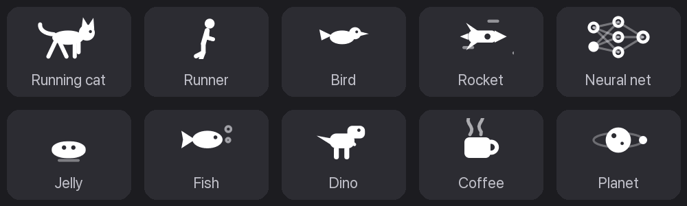
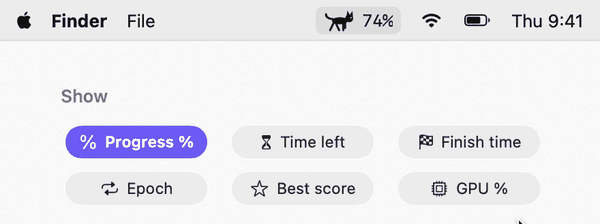
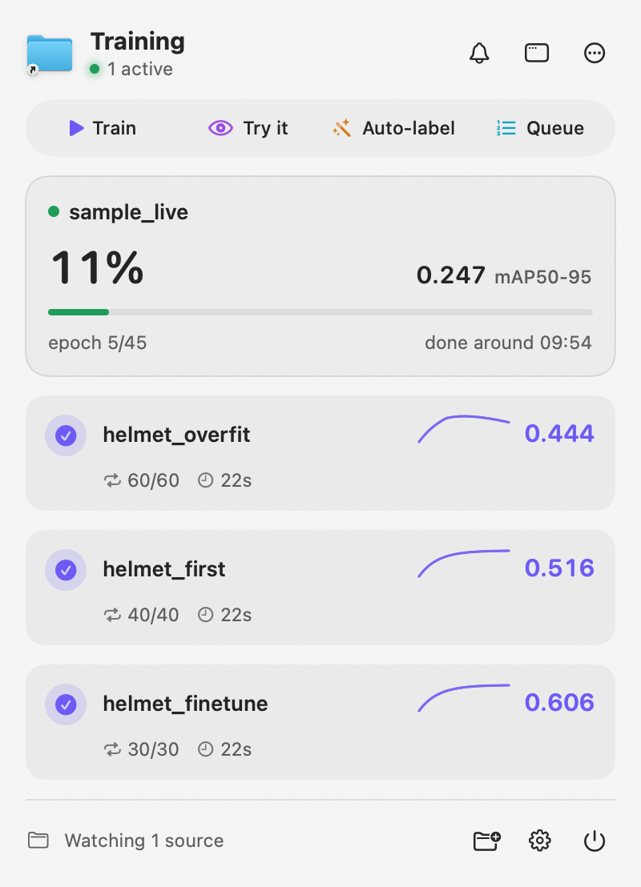
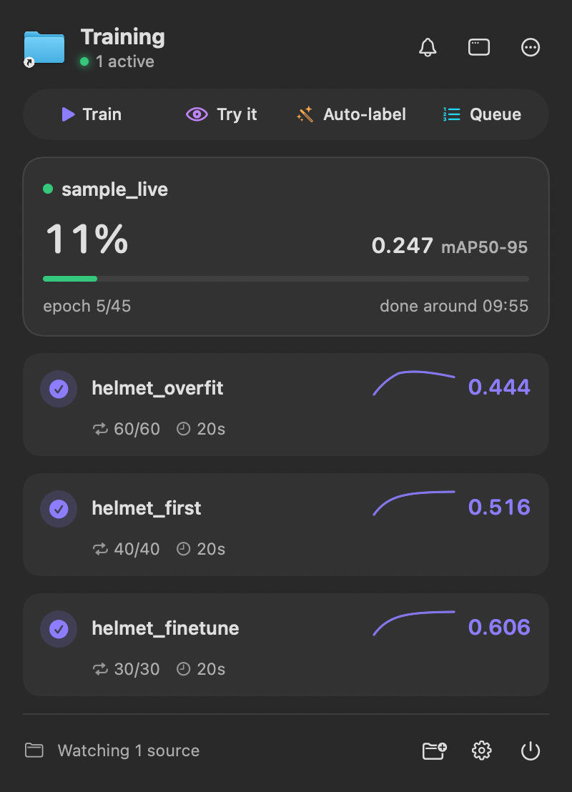
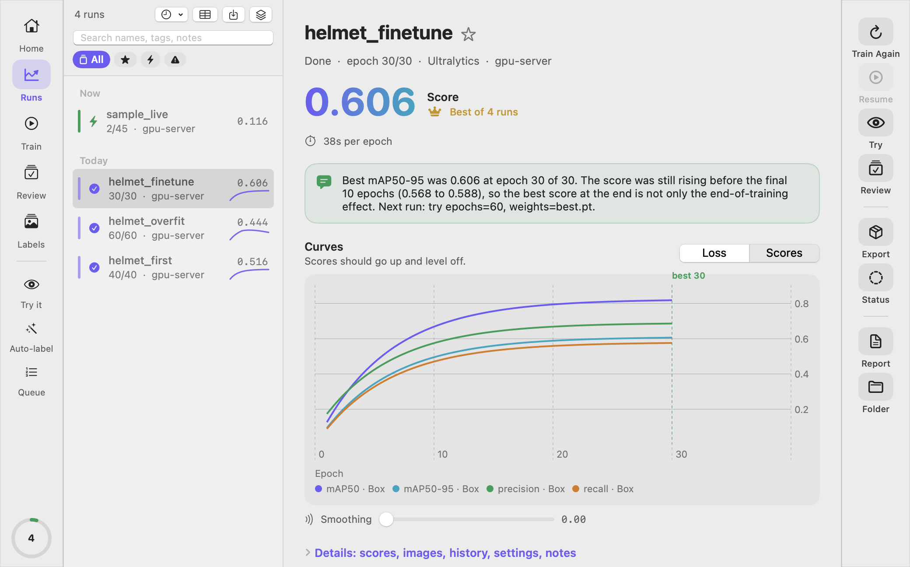
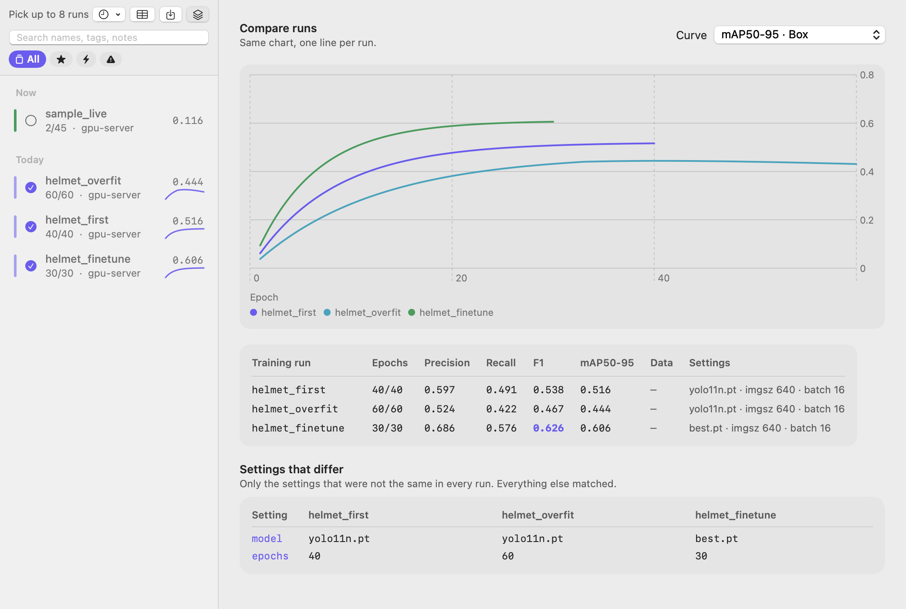

<p align="center">
  
</p>

<h1 align="center">Epokio</h1>

<p align="center">
  Watches the ML training runs on your machine or a remote GPU server: a macOS menu bar app, plus a web page for Windows, Linux and your phone.<br>
  No code changes and no account: point it at the folder your runs already write to.
</p>

<p align="center">
  <a href="https://pypi.org/project/epokio/"></a>
  <a href="https://github.com/8rulerstar/epokio/releases/latest"></a>
  <a href="https://github.com/8rulerstar/epokio/actions/workflows/ci.yml"></a>
  <a href="LICENSE"></a>
</p>

<p align="center">
  
</p>

<p align="center">
  <picture>
    <source media="(prefers-color-scheme: dark)" srcset="docs/images/menubar-info-toggle-dark.gif">
    
  </picture>
</p>

<p align="center">
  <a href="#quick-start">Quick start</a> ·
  <a href="#supported-formats">Formats</a> ·
  <a href="#alerts">Alerts</a> ·
  <a href="#remote-machines-over-ssh">SSH</a> ·
  <a href="#limits">Limits</a> ·
  <a href="docs/README.ko.md">한국어</a>
</p>

---

## What it does

* **Reads the logs you already have.** Ultralytics, Hugging Face Trainer, Lightning, Keras, timm, OpenMMLab, W&B local files, TensorBoard event files, MAE/DeiT-style `log.txt` and your own CSV. See [Supported formats](#supported-formats).
* **Progress, time left and best score in the menu bar**, live. A notification when a run finishes, fails (NaN loss), stalls (a crash or out-of-memory shows up this way) or stops before its last epoch.
* **Phone alerts** through ntfy, Slack, Discord or Telegram webhooks, sent by the training machine itself, with a test button to check they arrive.
* **Remote machines over SSH** with nothing installed on the server: only the new tail of each log is copied.
* **Per-class scores** (precision, recall, mAP per class, weakest first) and a plain-language note on what to change next.
* **Step-based runs** (W&B without `epoch`, TensorBoard step scalars, a CSV whose first column is `step`, `iter` or `iteration`) show progress in steps.
* **Compare, review and train** from the Studio window or the web page. Details in [docs/studio.md](docs/studio.md).

## Quick start

| Mac | Windows | Linux or a GPU server |
|---|---|---|
| [Download the `.dmg`](https://github.com/8rulerstar/epokio/releases/latest), drag to Applications, open | [Download `Epokio.exe`](https://github.com/8rulerstar/epokio/releases/latest), double-click | `pip install epokio` then `epokio watch --root runs/` in the terminal, or `epokio setup` for the web page |

* **Mac:** macOS 15 or later. The app is not notarized yet: open it once, close the warning, then **System Settings → Privacy & Security → Open Anyway**. On macOS 26, allow it in **System Settings → Menu Bar** if the icon is missing.
* **Windows:** SmartScreen may warn about an unsigned app the first time: **More info → Run anyway**. Watching needs no Python; training from the Train tab needs Python 3.10 or later.
* **Linux server:** use a virtual environment on Ubuntu 24.04 (PEP 668). Over SSH, setup prints an `ssh -L` tunnel command instead of opening a browser.
* **Phone:** the web page listens on this machine only. To open it from a phone, use that `ssh -L` tunnel or Tailscale, or start the helper with `--lan` (it then asks for a token; see [docs/remote.md](docs/remote.md)).

Full steps for Windows, Linux, the tray icon and remote helpers: [docs/remote.md](docs/remote.md).

## What it looks like

<p align="center">
  
  
</p>

<p align="center">
  
</p>

<p align="center">
  
</p>

**Resource use.** The background helper alone, watching 50 run folders on a Mac: about 45 MB of memory (RSS) and under 0.25 s of CPU per minute, close to 0%.

## Supported formats

Epokio reads the files your framework already writes. No logging code to add.

| Framework | What it reads | Watch, results, compare | Start runs | Auto-label, review |
|---|---|---|---|---|
| Ultralytics YOLO | `results.csv`, `args.yaml` | ✅ | ✅ | ✅ |
| Hugging Face Trainer | `trainer_state.json` (also inside `checkpoint-*`) | ✅ | script | |
| PyTorch Lightning | `CSVLogger` `metrics.csv`, `hparams.yaml` | ✅ | script | |
| Keras | `CSVLogger` file (`training.log`, `history.csv`) | ✅ | script | |
| TensorBoard logs | `events.out.tfevents.*` scalars, read without TensorFlow. By epoch when an `epoch` tag exists, otherwise by step | ✅ | script | |
| Vision research code (MAE, DeiT, DINO, BEiT, ConvNeXt) | `log.txt` with one JSON line per epoch | ✅ | script | |
| timm `train.py` | `summary.csv` (`eval_top1` becomes the main score), `args.yaml` | ✅ | script | |
| OpenMMLab (MMDetection 3.x, MMPretrain, MMSegmentation) | `vis_data/scalars.json`, `max_epochs` from the saved config (epoch-based training only) | ✅ | script | |
| Weights & Biases (local files) | `wandb/run-*/run-*.wandb`, read without installing wandb. By epoch when an `epoch` value is logged, otherwise by `_step`. Also over SSH | ✅ | script | |
| Your own training loop | a CSV whose first column is `epoch`, `step`, `iter` or `iteration` and that has a loss column | ✅ | script | |

Progress and time left need the planned length: epochs from the framework's own files or a config next to the log
(`args.yaml`, `args.json`, `config.yaml`, `config.json`, `hparams.yaml`, `opt.yaml`), and for step runs a step total
such as `max_steps`, `total_steps` or `max_iters` in the same files. Adding another framework is one small adapter
class, listed in `src/epokio/adapters.py`. To log from your own loop with `epokio.start`, see [docs/remote.md](docs/remote.md).

## Alerts

The training machine sends the alert itself, so it arrives even when your Mac is off. Webhooks must be `https`.
Add an [ntfy](https://ntfy.sh) address such as `https://ntfy.sh/your-secret-topic`, or a Slack, Discord or Telegram webhook:

* **Mac app:** Settings → Notifications.
* **Web page:** **Alerts**, then **Send a test** to check that it arrives (`POST /webhooks/test` on the helper).
* **Terminal**, with no helper running (handy on an SSH-only server):

```bash
epokio alerts --add https://ntfy.sh/your-secret-topic
epokio alerts --list
epokio alerts --test        # one test message to every saved webhook
epokio alerts --remove https://ntfy.sh/your-secret-topic
```

## Remote machines over SSH

In the Mac app, open **Settings → Machines → Over SSH** and pick a host from your `~/.ssh/config` (including `ProxyJump`).
Nothing is installed or written on the server.

* **Requirements:** `python3` 3.6 or later on the server and key-based login (no password or one-time-code prompts). No internet needed there.
* **What is copied:** only known log names (`results.csv`, `log.txt`, `summary.csv`, `metrics.csv`, `trainer_state.json`, TensorBoard and W&B files and a few more) and saved configs, never images or weights. Every 15 seconds; unchanged files are skipped and logs that only grow send just the new tail.
* **Size limit:** 4 MB for text logs, 20 MB for TensorBoard and W&B files (for a file Epokio already has, the limit applies to the new part). A growing text log over the limit keeps its first line and the last 4 MB, then keeps appending. TensorBoard, W&B and config files over the limit are skipped. The Mac app and the web page's SSH panel say how many files were skipped or cut.
* It looks under your home folder; add paths such as `/scratch/you/runs` under *Other folders*.
* This is view only. To start training on that machine, install the helper: on Linux `pip install epokio` then `epokio setup --lan --autostart`; on Windows `py -m pip install "epokio[tray]"` then `py -m epokio setup --lan --autostart` (no Python: `Epokio.exe setup --lan --autostart`). Tokens, `--lan` and network safety: [docs/remote.md](docs/remote.md).

## Limits

* OpenMMLab iteration-based runs (no epoch) are not read.
* Over SSH, only the known log file names are read, not any CSV. Binary logs and configs over the size limit are skipped.
* Your own CSV named `results.csv`, `metrics.csv` or `epokio_log.csv` is left to the Ultralytics, Lightning and `epokio.start` readers, so it is not read as your own CSV. Use another name.
* The resource numbers above are for the background helper alone, measured on a Mac with 50 run folders that were not changing (about 45 MB RSS, under 0.25 s of CPU per minute).
* The label editor and starting auto-label jobs are Mac only. The web page covers watching, training, the queue, compare, review, sweeps and alerts.
* The Mac app is not notarized and the Windows app is not signed, so both warn on first launch.
* The helper speaks plain HTTP. Prefer an SSH tunnel or Tailscale over `--lan`.


## How it compares

| | Epokio | TensorBoard | Cloud trackers (W&B, Comet) | MLflow, Aim | Ultralytics Platform | Trackio |
|---|---|---|---|---|---|---|
| Code changes in your training script | **None** | None if your framework writes event files | Add logging calls, or one setting via built-in integrations (HF Trainer, Ultralytics) | Add logging calls (MLflow has autolog) | None for Ultralytics: streams local training with an API key | Add `trackio.init` and `log` calls, or import TensorBoard/CSV logs |
| Account or server | **None** | None | Account | None locally (`mlflow ui`, `aim up`), or your own server | Account | None |
| Where your data goes | **Stays on your machines** | Your machine | Their cloud | Local folder (`./mlruns`, `.aim`) or your server | Their cloud | Your machine (or a Hugging Face Space and Dataset you choose) |
| Always visible | **Menu bar, terminal, tray** | Browser tab after `tensorboard --logdir` | Browser tab, phone app (iOS) | Browser tab | Browser tab | Browser tab |
| Formats in one view | **Ultralytics, HF, Lightning, Keras, timm, OpenMMLab, W&B, TensorBoard, CSV** | Its own event files | Their own logs (W&B can sync TensorBoard) | Their own logs (Aim converts TensorBoard, MLflow, W&B logs) | Ultralytics | Its own logs (imports TensorBoard and CSV) |
| Team sharing, model registry | Not the goal | No | **Yes** | Sharing on your server; registry in MLflow only | **Yes** | Partly |
| Per-step charts | Progress in steps for step-based runs | **Yes** | **Yes** | **Yes** | Per epoch | **Yes** |
| Price | Free, MIT | Free | Free tier and paid plans | Free software (hosted plans exist) | Free tier and paid plans | Free |

Epokio also sends its own alerts (Mac, tray, and phone webhooks) when a run finishes, fails or stalls, and suggests the next run from what it sees in the curves (for example "still improving: train 2× longer from best.pt"),
using simple rules on your machine rather than a cloud AI.

**Use it alongside a tracker, not instead of one.** If your team already logs to W&B or MLflow, keep doing that.
Epokio reads W&B's local files and TensorBoard logs too, so it can show the same runs in your menu bar or terminal
without another account or another logging call. It is what you glance at while training runs on your own Mac or GPU box.

## Privacy

Nothing leaves your machines unless you turn it on. The app talks only to helpers you run.

| Optional feature | What it sends | Where |
|---|---|---|
| Webhooks (ntfy, Slack, Discord, Telegram) | Run name, epoch, best score, event | The address you add |
| Assistant (plain-word commands) | Your sentence, names of up to 12 recent runs | TypeSafe, with your own API key |
| Result explanations, polished | Status, task, scores, setting numbers, language, the draft sentences | TypeSafe, only when the Assistant is on |
| Explanations written on this Mac (macOS 26+) | Nothing | Stays on the Mac |
| Update check (Sparkle), off in current releases until they are signed with an update key | App and macOS version | The project's GitHub releases |
| Mac app, setting up Python | Downloads a standalone Python (nothing is uploaded) | github.com/astral-sh/python-build-standalone |
| Report Issue (Mac app), only when you click Open | Opens a GitHub new-issue page with the end of `errors.log` (home folder shown as `~`) filled in, so it reaches github.com when the page opens; you can edit it or close the tab | github.com |
| Train tab, "set up Python" button | Downloads PyTorch, Ultralytics and their dependencies (nothing is uploaded) | PyPI and download.pytorch.org |

Webhooks must be `https`. The TypeSafe key lives in your Keychain and both features are off until you
turn them on. Error logs stay in `~/.epokio/logs` and leave only through Report Issue, when you click Open.

## When something is off

* `epokio doctor` (needs `pip install epokio`; `Epokio.exe` has no `doctor`) prints what Epokio sees: its version, whether the helper is running (and which version),
  the folders it watches, the Python environments it found and the last lines of its log. It never prints
  the token, so you can paste the output into a bug report (`--json` for the raw data).
* The helper writes `~/.epokio/agent.log` (1 MB, one old copy kept), with the reason behind any error.
* After upgrading, run `epokio setup` again: it restarts a helper that is still running the old version.
  `epokio agent --stop` (or `Epokio.exe agent --stop`) stops the helper on this machine.

## Uninstall

Quit Epokio, move `Epokio.app` to the Trash, stop a helper you started yourself (`epokio agent --stop`; the app stops the one it started), then `rm -rf ~/.epokio` and `pip uninstall epokio` if you used pip.
Settings, Keychain items, Windows and Linux steps: [docs/uninstall.md](docs/uninstall.md).

## More

* [docs/studio.md](docs/studio.md): menu bar, characters, results and the Studio window in detail
* [docs/remote.md](docs/remote.md): remote helpers, tokens, Windows, Linux, tray, terminal view, your own training loop
* [docs/mcp.md](docs/mcp.md): use with AI assistants (MCP) and plain-word commands
* [docs/uninstall.md](docs/uninstall.md): full uninstall
* [docs/README.ko.md](docs/README.ko.md): 한국어
* [docs/DESIGN.md](docs/DESIGN.md): how the pieces fit together

## Status

The features above work today and have automated tests, and [CHANGELOG.md](CHANGELOG.md) lists what
changed in each version. Bug reports and ideas are welcome as issues.

**Using Epokio?** A line in [Discussions](https://github.com/8rulerstar/epokio/discussions/categories/show-and-tell) about what you train with it helps more than you would think, even if nothing is wrong.

See [CONTRIBUTING.md](CONTRIBUTING.md) before opening a
pull request, and [docs/DESIGN.md](docs/DESIGN.md) for how the pieces fit together.

The Mac app speaks English, Korean, Japanese, Chinese (Simplified and Traditional), Spanish, French, German, Portuguese (Brazil) and Vietnamese. Corrections are welcome as issues. It follows your Mac's language (or pick one in Settings → General). The web page speaks English and Korean and follows your browser, with a language button at the top.

License: [MIT](LICENSE).

Screenshots on this page use the sample runs the app can create for you.
