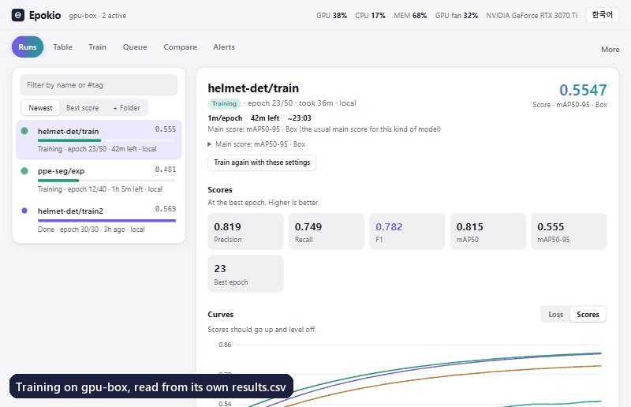
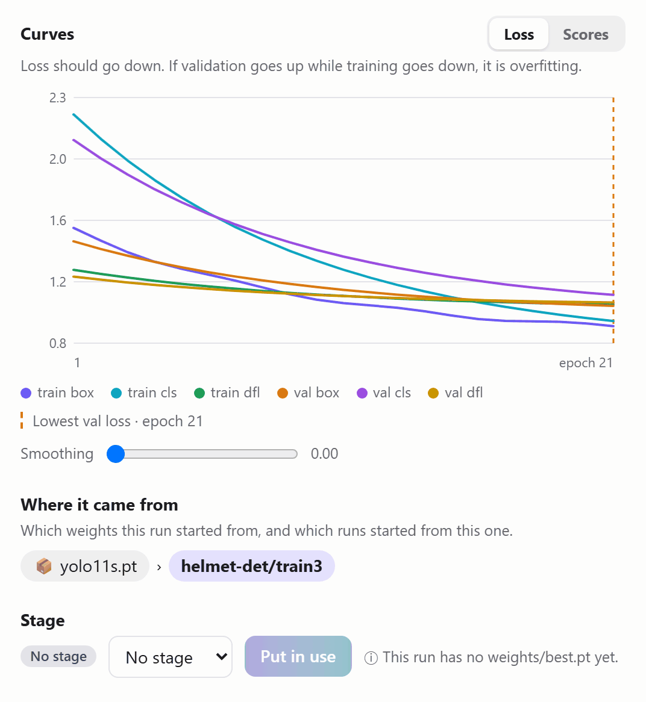
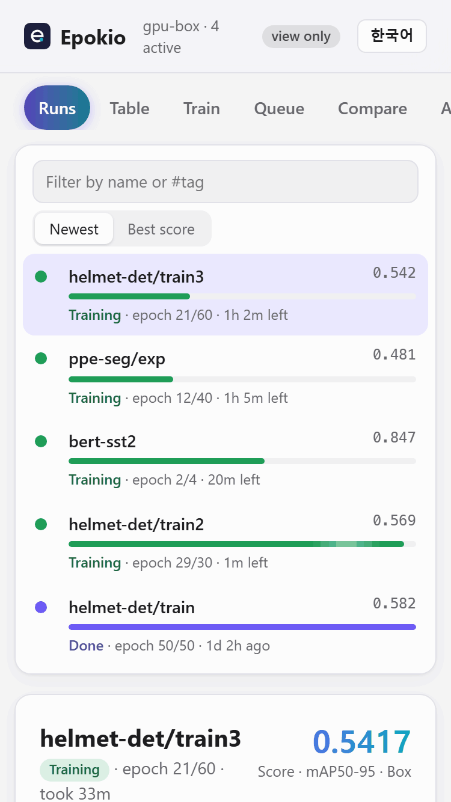

<p align="center"></p>
<h1 align="center">Epokio</h1>
<p align="center"><b>Epokio는 이미 있는 학습 기록을 읽고, 학습이 멈추거나 NaN이 나거나 끝나면 폰으로 알려 줍니다.</b><br>
코드 수정도 계정도 필요 없습니다. YOLO, Hugging Face, Lightning, Keras, TensorBoard가 이미 남기는 기록을 읽습니다. SSH로도 됩니다.</p>
<p align="center"><a href="https://pypi.org/project/epokio/"></a> <a href="../LICENSE"></a> · <a href="../README.md">English</a></p>

<p align="center"></p>

## 빠른 시작

파이썬 3.10 이상이면 윈도우, 맥, 리눅스 어디서나 됩니다. 학습을 돌리는 기계에서 터미널을 프로젝트 폴더에 열고:

```bash
pip install epokio
epokio setup
epokio watch --once
```

`epokio setup`은 학습 기록을 찾고, 도우미(기록을 읽고 알림을 보내는 작은 백그라운드 프로그램)를 띄우고, 그 웹 화면을 엽니다. `epokio watch --once`는 같은 목록을 터미널에 찍습니다.
setup은 지금 폴더와 바탕 화면, 문서, 다운로드, Projects, `~/runs`를 찾아봅니다(사용자 폴더 안만). `D:\`나 `/data`처럼 다른 곳에 있으면 폴더를 알려 주세요: `epokio setup --root D:\myproject\runs`.
윈도우에서 `pip`이나 `epokio`를 못 찾는다고 나오면 앞에 `py -m`을 붙이세요: `py -m epokio setup`.
pip이 *externally-managed-environment*로 멈추면(Ubuntu 24.04, Homebrew 파이썬) 가상환경이나 conda 환경에 설치하세요([방법](remote.md#on-windows-linux-or-your-phone), 영어).

## SSH로 쓰는 공용 GPU 서버에서

sudo는 필요 없습니다. 서버의 내 계정에서(conda 환경도 됩니다):

```bash
python3 -m venv ~/.epokio-venv && ~/.epokio-venv/bin/pip install epokio
~/.epokio-venv/bin/epokio setup --root /data/you/runs --autostart
```

`--autostart`는 systemd 사용자 서비스를 만들어, SSH를 끊거나 서버를 다시 켜도 도우미가 돌아옵니다. 로그아웃 뒤에도 돌게 setup이 linger를 켭니다(`loginctl enable-linger $USER`). 서버가 거절하면 관리자가 한 번 `sudo loginctl enable-linger <내 계정>`을 돌려 주면 됩니다.
`epokio doctor`가 도우미가 지금 도는지, 다시 돌아오는지를 한 줄로 보여 줍니다. setup이 내 컴퓨터에서 돌릴 터널 명령(예: `ssh -N -L 18787:127.0.0.1:8787 <server>`)을 알려 주고, 그 뒤 `http://127.0.0.1:18787/`에서 서버의 학습이 보입니다. 그냥 SSH 창에서는 `epokio watch`로 보면 됩니다.
같은 서버의 다른 계정도 `127.0.0.1`의 도우미를 읽을 수 있으니, 공용 기계라면 [한계](guide.ko.md#한계)를 보세요.

## 폰 알림, 세 단계

1. 폰에 [ntfy](https://ntfy.sh) 앱을 깔고, 나만 아는 주제를 구독합니다. 주제 이름에는 영문, 숫자, `-`, `_`만 쓸 수 있습니다. ntfy.sh에서는 주제 이름이 비밀번호 구실을 합니다. 이름을 아는 사람은 누구나 알림을 볼 수 있으니 길게 짓거나 [ntfy 서버를 직접 두세요](https://docs.ntfy.sh/install/).
2. 학습 기계에 저장합니다. `your-secret-topic` 자리에 내 주제를 넣으세요: `epokio alerts --add https://ntfy.sh/your-secret-topic`
3. 시험해 봅니다: `epokio alerts --test`

이제 도우미가 학습이 끝나거나, 실패하거나(NaN, 비정상 종료), 멈추면(평소 에폭 시간보다 한참, 적어도 3분 넘게 새 에폭이 없으면, 이 바닥값은 `epokio config stall_min 10`처럼 올릴 수 있습니다) 알림을 보냅니다. Slack, Discord, 텔레그램 웹훅도 똑같이 넣으면 됩니다(`https`만).
알림은 도우미가 떠 있을 때만 갑니다. `epokio setup --autostart`는 sudo 없이 도우미를 다시 띄웁니다. 리눅스는 systemd 사용자 서비스라 로그아웃·재부팅 뒤에도 돌고, 맥(LaunchAgent)과 윈도우(시작프로그램 폴더)는 로그인할 때 시작합니다.
`epokio doctor`는 지금 도는지와 다시 돌아오는지를 보여 주고, `epokio doctor --test-alert`는 진짜 시험 알림을 보냅니다.

## 이런 걸 봅니다

<p align="center">
  
  
</p>

* **모든 학습을 한 목록에서 실시간으로.** 진행률, 남은 시간, 최고 점수. 어느 프레임워크가 남긴 기록이든 됩니다.
* **곡선과 쉬운 말 메모.** 검증 손실이 가장 낮은 에폭을 표시하고, 점수가 떨어지기 시작하면 알려 줍니다.
* **폰에서도.** `epokio setup --lan`이 주소와 보기 전용 토큰을 알려 줍니다. 그 토큰으로는 다 보이지만 바꾸는 단추는 전부 숨겨집니다.
* **터미널에서도**(`epokio watch`, SSH에 좋습니다), 윈도우·리눅스 트레이 아이콘, [맥 메뉴바 앱](studio.md)(영어).
* **계정도, 업로드도 없습니다.** 내가 넣은 알림만 기계 밖으로 나갑니다.

## 노트북과 코랩

도우미를 띄울 수 없는 곳에서는 학습 프로세스가 직접 알림을 보냅니다.

```python
!pip install epokio
!epokio alerts --add https://ntfy.sh/your-secret-topic

import epokio
with epokio.start("runs/colab-exp", epochs=20, notify=True) as run:
    for epoch in range(20):
        ...
        run.log(train_loss=tl, val_loss=vl, acc=acc)
```

블록이 끝나면, 또는 오류가 나면(오류 내용과 함께) 알림이 옵니다. 네트워크가 끊겨도 학습은 멈추지 않습니다.

## 기본 보안

* 도우미는 `127.0.0.1`에서만 듣습니다. `setup --lan`을 붙이면 네트워크에 열리고 토큰을 요구합니다.
* 웹 화면(과 MCP)에서 학습, 대기열 작업, 스윕을 시작하는 기능은 꺼져 있습니다. `epokio config launch_runs on`으로 켜면 Train, Queue, Sweeps 탭이 나타납니다.
* 새로 만든 토큰은 보기 전용이고, 바꾸기까지 하는 토큰은 `epokio agent --add-token NAME --scope run`으로 만듭니다.
* `--lan`으로 연 도우미는 `--allow-run`으로 띄우지 않는 한 네트워크로 온 것을 실행하지 않습니다.
* 공용 서버에서는 다른 계정도 `127.0.0.1`의 도우미를 읽을 수 있습니다. SSH로 들어온 리눅스에서는 `epokio setup`이 보는 것에도 토큰이 필요하게 할지 묻습니다(`reads_token always`, 터미널이 아니면 기본으로 켜고 `--no-lock-reads`면 건너뜀. 웹 화면은 `epokio agent --show-token`의 토큰을 한 번 묻습니다). 그 밖에서는 `epokio config reads_token always`를 치고, 사람마다 그 사람 폴더로 제한한 토큰을 주세요([방법](guide.ko.md#한계)).
* 도우미는 암호화되지 않은 HTTP를 씁니다. `--lan`보다 SSH 터널이나 Tailscale이 낫습니다. 자세히: [remote.md](remote.md)(영어).

## 다른 도구와 비교

2026년 10월에 각 프로젝트의 README와 문서로 확인했습니다. Epokio는 TensorBoard 이벤트 파일과 W&B 로컬 파일도 읽으니 함께 써도 됩니다.

| | 코드 수정 | 계정 | 알림 | 이럴 땐 그쪽을 |
|---|---|---|---|---|
| **Epokio** | 프레임워크가 읽을 수 있는 파일을 남기면 없음(Keras는 `CSVLogger`나 `TensorBoard` 콜백) | 없음 | 멈춤, NaN·비정상 종료, 끝남 | |
| **TensorBoard** | 코드나 프레임워크가 이벤트 파일을 남겨야 함 | 없음 | 없음 | step별 그래프, 그림, 히스토그램, 프로파일러가 필요할 때 |
| **W&B** | `wandb.init`/`log` 또는 프레임워크 연동 | 필요 | 끝남·비정상 종료(Slack, 이메일), 내 코드의 `run.alert()` | 팀이 대시보드, 스윕, 아티팩트, 모델 레지스트리를 같이 쓸 때 |
| **Trackio**(Hugging Face) | `trackio.init`/`log`(W&B식 API) 또는 HF Trainer `report_to="trackio"` | 없음(HF Space는 선택) | 내 코드의 `trackio.alert()`, 웹훅으로 | 무료 로컬 W&B식 대시보드를 Space로 공유하고 싶을 때 |
| **knockknock** | 학습 함수에 데코레이터 | 없음(메신저 자격 증명 필요) | 시작·끝남·비정상 종료, 12개 서비스(마지막 배포 2020년) | 이메일, Teams, SMS 같은 곳으로 끝남·실패만 알면 될 때 |
| **runmon** | 없음: 명령을 감싸거나 tmux에 붙음 | 없음(ntfy, 텔레그램, Bark, 웹훅으로 바로. 앱은 직접 둘 수 있는 중계 서버로 짝 맺기) | 끝남, 실패, 오류 출력, GPU 놀음, 로그 끊김, 디스크 가득 | 프로세스별 GPU 보기나, 학습 기록이 아닌 아무 명령의 알림이 필요할 때 |

더 많은 비교(MLflow, Aim, Ultralytics Platform, 가격): [guide.ko.md](guide.ko.md#다른-도구와-비교).

## 읽는 형식

Ultralytics YOLO, Hugging Face Trainer, PyTorch Lightning(`CSVLogger`), Keras(`CSVLogger` 또는 `TensorBoard` 콜백),
TensorBoard 이벤트 파일과 W&B 로컬 파일(둘 다 설치할 필요 없음), timm, OpenMMLab, MAE·DeiT 계열 `log.txt`,
직접 짠 루프: `epokio.start`, 또는 첫 열이 `epoch`·`step`·`iter`·`iteration`인 CSV.
각각 어떤 파일을 읽는지, 계획 에폭과 최고 점수 규칙: [guide.ko.md](guide.ko.md#읽는-형식).

## 더 보기

[안내서](guide.ko.md)(알림, 한계, 전체 비교, 개인정보, 문제 해결) ·
[맥 앱](studio.md) · [원격 도우미, 윈도우 앱, 트레이, 폰](remote.md) · [AI 어시스턴트(MCP)](mcp.md) · [제거](uninstall.md)(이상 영어) ·
[CHANGELOG](../CHANGELOG.md) · [CONTRIBUTING](../CONTRIBUTING.md)

문제가 있으면 `epokio doctor` 출력을 이슈에 붙여 주세요(토큰은 출력하지 않습니다). 라이선스: [MIT](../LICENSE).
