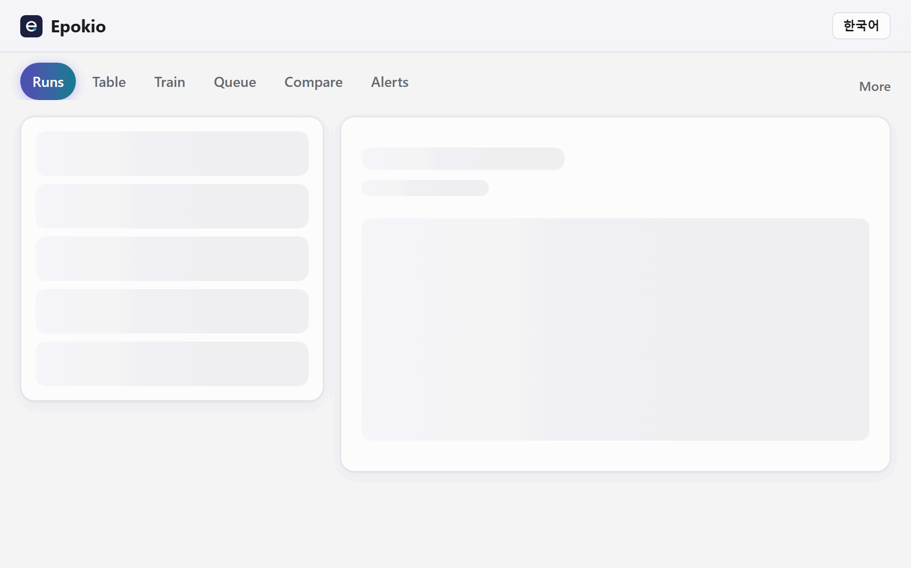

# Epokio guide

[Back to README](../README.md) · [한국어](guide.ko.md)

The details behind the README: formats, alerts, SSH, limits, comparison, privacy and troubleshooting.

## Install the apps

| Mac | Windows | Linux or a GPU server |
|---|---|---|
| [Download the `.dmg`](https://github.com/8rulerstar/epokio/releases/latest), drag to Applications, open | [Download `Epokio.exe`](https://github.com/8rulerstar/epokio/releases/latest), double-click | `pip install epokio`, then `epokio setup` |

* **Mac:** macOS 15 or later. The app is not notarized yet: open it once, close the warning, then **System Settings → Privacy & Security → Open Anyway**. On macOS 26, allow it in **System Settings → Menu Bar** if the icon is missing.
* **Windows:** SmartScreen may warn about an unsigned app the first time: **More info → Run anyway**. Watching needs no Python. Training from the Train tab needs Python 3.10 or later.
* **Linux server:** use a virtual environment on Ubuntu 24.04 (PEP 668). Over SSH, setup prints an `ssh -L` tunnel command instead of opening a browser.
* **Phone:** the web page listens on this machine only. To open it from a phone, use that `ssh -L` tunnel or Tailscale, or start the helper with `--lan` (it then asks for a token; see [remote.md](remote.md)).

Full steps for Windows, Linux, the tray icon and remote helpers: [remote.md](remote.md).

## What it does

<p align="center">
  
</p>

* **Reads the logs you already have.** Ultralytics, Hugging Face Trainer, Lightning, Keras, timm, OpenMMLab, W&B local files, TensorBoard event files, MAE/DeiT-style `log.txt` and your own CSV.
* **Progress, time left and best score**, live, in the menu bar, tray, terminal or web page. A notification when a run finishes, fails (NaN loss), stalls (a crash or out-of-memory shows up this way) or stops before its last epoch.
* **Phone alerts** through ntfy, Slack, Discord or Telegram webhooks, sent by the training machine itself.
* **Remote machines over SSH** with nothing installed on the server: only the new tail of each log is copied.
* **Per-class scores** (precision, recall, mAP per class, weakest first) for Ultralytics runs started from Epokio, or after a one-click per-class check, and a plain-language note on what to change next.
* **Step-based runs** (W&B without `epoch`, TensorBoard step scalars, a CSV whose first column is `step`, `iter` or `iteration`) show progress in steps.
* **More:** the macOS menu bar app, a Studio window, compare, starting and queuing runs, labeling review, sweeps and dataset views. See [studio.md](studio.md).

## Supported formats

Epokio reads the files your framework already writes, so there is no logging code to add when your framework writes one of these.
Keras needs a `CSVLogger` or `TensorBoard` callback. A hand-written loop uses `epokio.start`.

| Framework | What it reads |
|---|---|
| Ultralytics YOLO | `results.csv`, `args.yaml` |
| Hugging Face Trainer | `trainer_state.json` (also inside `checkpoint-*`) |
| PyTorch Lightning | `CSVLogger` `metrics.csv`, `hparams.yaml` |
| Keras | `CSVLogger` file (`training.log`, `history.csv`) |
| TensorBoard logs | `events.out.tfevents.*` scalars, read without TensorFlow. By epoch when an `epoch` tag exists, otherwise by step |
| Vision research code (MAE, DeiT, DINO, BEiT, ConvNeXt) | `log.txt` with one JSON line per epoch |
| timm `train.py` | `summary.csv` (`eval_top1` becomes the main score), `args.yaml` |
| OpenMMLab (MMDetection 3.x, MMPretrain, MMSegmentation) | `vis_data/scalars.json`, `max_epochs` from the saved config (epoch-based training only) |
| Weights & Biases (local files) | `wandb/run-*/run-*.wandb`, read without installing wandb. By epoch when an `epoch` value is logged, otherwise by `_step`. Also over SSH |
| Your own training loop | a CSV whose first column is `epoch`, `step`, `iter` or `iteration` and that has a loss column |

**Best score.** It is shown when the run logs a validation metric (or Hugging Face's `best_metric`).
Runs that log only a loss show none. The exception is Hugging Face runs that evaluate only `eval_loss`: there the lowest `eval_loss` is the best score.
Hugging Face runs update when a checkpoint is saved, because that is when `trainer_state.json` is written.
To pick the main score yourself: `epokio score <run or folder> <column> [--lower]`, `--auto` or `--list`.

**Progress and time left** need the planned length: epochs from the framework's own files or a config next to the log
(`args.yaml`, `args.json`, `config.yaml`, `config.json`, `hparams.yaml`, `opt.yaml`), and for step runs a step total
such as `max_steps`, `total_steps` or `max_iters` in the same files. Keras's `CSVLogger` does not record the plan, so for it
Epokio reads `epochs` from a config next to the log. For Lightning it reads `max_epochs` (or `epochs`) from `hparams.yaml`,
which has it only if you saved it as a hyperparameter. Without these, a run shows its epoch but no progress or time left.

Adding another framework is one small adapter class, listed in `src/epokio/adapters.py`. To log from your own loop with `epokio.start`, see [remote.md](remote.md).

## Alerts

The helper on the training machine sends the alert itself, so it arrives with your laptop off, but only while that helper is running. Webhooks must be `https`.
Add an [ntfy](https://ntfy.sh) address such as `https://ntfy.sh/your-secret-topic`, or a Slack, Discord or Telegram webhook:

* **Mac app:** Settings → Notifications.
* **Web page:** **Alerts**, then **Send a test** to check that it arrives (`POST /webhooks/test` on the helper).
* **Terminal**, without opening the app or the page. The command writes the same settings, so no helper needs to run to save them:

```bash
epokio alerts --add https://ntfy.sh/your-secret-topic
epokio alerts --list        # shows the host with the path masked
epokio alerts --test        # one test message to every saved webhook
epokio alerts --remove https://ntfy.sh/your-secret-topic
epokio alerts --lang ko     # language of the alert text
```

On Windows, `py -m epokio alerts ...` works when `epokio` is not on PATH.

A run with no planned epochs that goes quiet gets a calm *Training stopped logging* notice instead of the stalled alert, and it is not sent to phone webhooks unless you choose it.

* **Delivery:** a send that fails on the network, a 429 or a 5xx is tried twice more (after 5 and 30 seconds). A 4xx (wrong or revoked address) is not retried; `epokio doctor` and `agent.log` show why.
* **Helper restarted:** if the helper was off while a run finished, failed or stopped (an update, a reboot), the alert is sent when it starts again, for changes up to two days old.
* **Kinds:** turning every kind off in the Mac app keeps them all off. Goal alerts are always sent, because you set the goal yourself.
* **Goal:** the goal is compared with the run's best score, which is the score of the saved best model (`best.pt`). For YOLO segmentation, pose and classification, `best.pt` is chosen on mask (or pose) mAP plus box mAP, so its mask score can sit a little below that column's highest value. A goal just under the column's peak may then never fire. This is on purpose: the alert means the model you would use has reached the goal.
* **Quiet hours** (Mac app: Settings → Notifications): no phone pushes in those hours. The alerts still show in the app and on the web **Alerts** tab, but the pushes are not sent later.

With `epokio.start(..., notify=True)` the training process sends the alert itself when the `with` block ends (finished) or ends with an error (failed, with the error type and message). Only the standard library is used, and a network failure never stops training. If a helper is also watching that folder, it does not send the same alert again.

## SSH from the Mac app

In the Mac app, open **Settings → Machines → Over SSH** and pick a host from your `~/.ssh/config` (including `ProxyJump`).
Nothing is installed or written on the server.

* **Requirements:** `python3` 3.6 or later on the server and key-based login (no password or one-time-code prompts). No internet needed there.
* **What is copied:** only known log names (`results.csv`, `log.txt`, `summary.csv`, `metrics.csv`, `trainer_state.json`, TensorBoard and W&B files and a few more) and saved configs, never images or weights. Every 15 seconds; unchanged files are skipped and logs that only grow send just the new tail.
* **Size limit:** 4 MB for text logs, 20 MB for TensorBoard and W&B files (for a file Epokio already has, the limit applies to the new part). A growing text log over the limit keeps its first line and the last 4 MB, then keeps appending. TensorBoard, W&B and config files over the limit are skipped. The Mac app and the web page's SSH panel say how many files were skipped or cut.
* It looks under your home folder. Add paths such as `/scratch/you/runs` under *Other folders*.
* Alerts for runs mirrored over SSH name the server (`ssh:<host>`).
* This is view only. To start training on that machine from elsewhere, install the helper there with `--lan --allow-run` (on Linux `pip install epokio` then `epokio setup --lan --allow-run --autostart`; on Windows `py -m pip install "epokio[tray]"` then `py -m epokio setup --lan --allow-run --autostart`, or `Epokio.exe setup ...` without Python) and give your Mac a run token (`epokio agent --add-token mac --scope run`). Tokens, `--lan` and network safety: [remote.md](remote.md).

### What runs on your server over SSH

Every 15 seconds Epokio runs `ssh -o BatchMode=yes -o ConnectTimeout=8 <host> python3 - '<settings>'` (plus `ControlMaster=auto`, `ControlPersist=120` and a control socket under `~/.epokio/ssh-control` on macOS and Linux, so it logs in once and reuses the connection). On standard input it sends one script, [`src/epokio/ssh_remote.py`](../src/epokio/ssh_remote.py) (standard library only, Python 3.6+). That script looks for the known log file names under your home folder and the folders you added, and prints their contents, or only the part added since last time, as JSON. It writes nothing on the server, starts no process, installs nothing and never reads images or weights. BatchMode means it never answers a password or host-key prompt.

## Limits

* OpenMMLab iteration-based runs (no epoch) are not read.
* Over SSH, only the known log file names are read, not any CSV. Binary logs and configs over the size limit are skipped.
* Your own CSV named `results.csv`, `metrics.csv` or `epokio_log.csv` is left to the Ultralytics, Lightning and `epokio.start` readers, so it is not read as your own CSV. Use another name.
* **Shared servers:** by default any user who can log in to the machine can read the helper on `127.0.0.1` (runs, settings, logs). Start it as `epokio agent --require-token` so that viewing needs a token too (stop a helper that `epokio setup` started first: `epokio agent --stop`; this one runs in the foreground, so use tmux or a service), then give each person a token limited to their folders: `epokio agent --add-token alice --scope read --root /data/alice/runs` (`--root` can repeat and can be a pattern). That token sees only runs under those folders in the run list, run pages, images, events and the table, and nothing else (no queue, sweeps, settings or changes). Tokens without `--root` see every watched run.
* The Mac app is not notarized and the Windows app is not signed, so both warn on first launch.
* The helper speaks plain HTTP. Prefer an SSH tunnel or Tailscale over `--lan`. A helper opened with `--lan` only shows runs unless started with `--allow-run`, and new tokens are view-only unless made with `--scope run`.

**Resource use.** The background helper alone: about 45 MB of memory (RSS) with 50 run folders on a Mac. CPU is about 0.67 s per minute with 330 run folders and nothing training, and about 1.7 s per minute while one run is live (well under 1% of one core).

## How it compares

| | Epokio | TensorBoard | Cloud trackers (W&B, Comet) | MLflow, Aim | Ultralytics Platform | Trackio |
|---|---|---|---|---|---|---|
| Code changes in your training script | **None** if your framework writes a supported file (Keras: a `CSVLogger` or `TensorBoard` callback) | None if your framework writes event files | Add logging calls, or one setting via built-in integrations (HF Trainer, Ultralytics) | Add logging calls, or one setting for MLflow via built-in integrations (HF Trainer `report_to="mlflow"`, Lightning `MLFlowLogger`, Ultralytics `mlflow` setting); MLflow also has autolog | None for Ultralytics: streams local training with an API key | Add `trackio.init` and `log` calls, or one setting in HF Trainer (`report_to="trackio"`); imports TensorBoard/CSV logs |
| Account or server | **None** | None | Account | None locally (`mlflow ui`, `aim up`), or your own server | Account | None |
| Where your data goes | **Stays on your machines** | Your machine | Their cloud by default; self-hosted or offline available | Local folder (`./mlruns`, `.aim`) or your server | Their cloud | Your machine (or a Hugging Face Space and Dataset you choose) |
| Always visible | **Menu bar, terminal, tray** | Browser tab after `tensorboard --logdir` | Browser tab, phone app (iOS) | Browser tab | Browser tab | Browser tab |
| Formats in one view | **Ultralytics, HF, Lightning, Keras, timm, OpenMMLab, W&B, TensorBoard, CSV** | Its own event files | Their own logs (W&B can sync TensorBoard) | Their own logs (Aim converts TensorBoard, MLflow, W&B logs) | Ultralytics | Its own logs (imports TensorBoard and CSV) |
| Team sharing, model registry | Not the goal | No | **Yes** | Sharing on your server; registry in MLflow only | **Yes** | Partly |
| Per-step charts | Progress in steps for step-based runs | **Yes** | **Yes** | **Yes** | Per epoch | **Yes** |
| Price (as of 2026-10) | Free, MIT | Free | Free tier and paid plans | Free software (hosted plans exist) | Free tier and paid plans | Free |

Epokio also suggests the next run from what it sees in the curves (for example "still improving: train 2× longer from best.pt"),
using simple rules on your machine rather than a cloud AI.

**Use it alongside a tracker, not instead of one.** If your team already logs to W&B or MLflow, keep doing that.
Epokio reads W&B's local files and TensorBoard logs too, so it can show the same runs in your menu bar or terminal
without another account or another logging call.

## Privacy

Nothing leaves your machines unless you turn it on. The app talks only to helpers you run.

| Optional feature | What it sends | Where |
|---|---|---|
| Webhooks (ntfy, Slack, Discord, Telegram) | Run name, epoch, best score and metric name, event, machine name, and for a failed `epokio.start` run the error type and message | The address you add |
| Assistant (plain-word commands) | Your sentence, names of up to 12 recent runs | TypeSafe, with your own API key |
| Result explanations, polished | Status, task, scores, setting numbers, language, the draft sentences | TypeSafe, only when the Assistant is on |
| Explanations written on this Mac (macOS 26+) | Nothing | Stays on the Mac |
| Update check (Sparkle), off in current releases until they are signed with an update key | App and macOS version | The project's GitHub releases |
| Mac app, setting up Python | Downloads a standalone Python (nothing is uploaded) | github.com/astral-sh/python-build-standalone |
| Report Issue (Mac app), only when you click Open | Opens a GitHub new-issue page with the end of `errors.log` (home folder shown as `~`) filled in, so it reaches github.com when the page opens; you can edit it or close the tab | github.com |
| Train tab, "set up Python" button | Downloads PyTorch, Ultralytics and their dependencies (nothing is uploaded) | PyPI and download.pytorch.org |

Webhooks must be `https`. Webhook addresses are not written to logs. The TypeSafe key lives in your Keychain and both features are off until you
turn them on. Error logs stay in `~/.epokio/logs` and leave only through Report Issue, when you click Open.
The helper's `/ai` view says which AI tools are running on that machine and how busy they are (process names and CPU only,
never prompts), for the menu-bar character. Like the run list, anyone who can view the helper can read it.

## When something is off

* `epokio doctor` (needs `pip install epokio`; `Epokio.exe` has no `doctor`) prints what Epokio sees: its version, whether the helper is running (and which version),
  the folders it watches, the Python environments it found and the last lines of its log. It never prints
  the token, so you can paste the output into a bug report (`--json` for the raw data).
* The helper writes `~/.epokio/agent.log` (1 MB, one old copy kept), with the reason behind any error.
* After upgrading, run `epokio setup` again: it restarts a helper that is still running the old version.
  `epokio agent --stop` (or `Epokio.exe agent --stop`) stops the helper on this machine.

## Uninstall

Quit Epokio, move `Epokio.app` to the Trash, stop a helper you started yourself (`epokio agent --stop`; the app stops the one it started), then `rm -rf ~/.epokio` and `pip uninstall epokio` if you used pip.
Settings, Keychain items, Windows and Linux steps: [uninstall.md](uninstall.md).

## Status and languages

The features work today and have automated tests. [CHANGELOG.md](../CHANGELOG.md) lists what changed in each version.
Bug reports and ideas are welcome as issues. See [CONTRIBUTING.md](../CONTRIBUTING.md) before opening a pull request.

**Using Epokio?** A line in [Discussions](https://github.com/8rulerstar/epokio/discussions/categories/show-and-tell) about what you train with it helps, even if nothing is wrong.

The Mac app speaks English, Korean, Japanese, Chinese (Simplified and Traditional), Spanish, French, German, Portuguese (Brazil) and Vietnamese. It follows your Mac's language (or pick one in Settings → General). Corrections are welcome as issues. The web page speaks English and Korean and follows your browser, with a language button at the top.

Screenshots use the sample runs the app can create for you.
